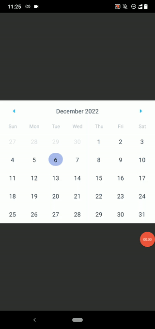

# react-native-date-range-picker
Implementing a custom date range picker with the [react-native-calendars](https://github.com/wix/react-native-calendars) package

## Preview



## How to run this project?

- Clone or download this repository
- Install dependencies:

```bash
npm install
# --- or ---
yarn install
```

- Start the Metro bundler:

```bash
npm start
# --- or ---
yarn start
```

- Run the project on a virtual or physical device:

```bash
npx react-native run-android
# --- or ---
npx react-native run-ios
```

## License
[MIT](LICENSE)
